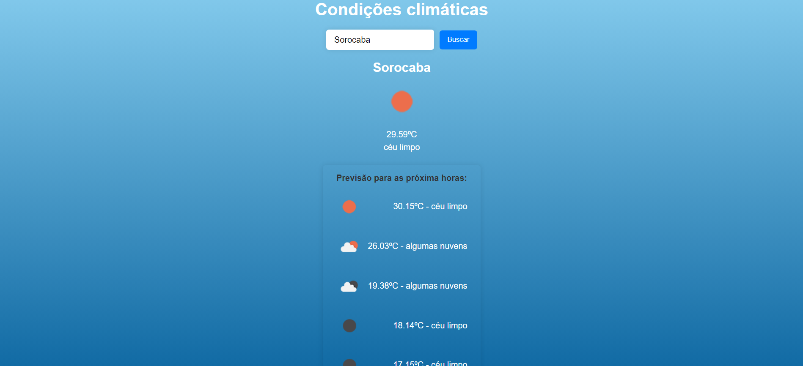

# (Weather)

This is a [Weather](project link). 

## Table of contents

- [Overview](#overview)
  - [The purpose](#The-purpose)
  - [Screenshot](#screenshot)
- [My process](#my-process)
  - [Built with](#built-with)
  - [What I learned](#what-i-learned)
  - [Continued development](#continued-development)
- [Author](#author)

## Overview

### The-purpose

Users should be able to:

- Type in and search for a city and get its current weather, temperature, state and the forecast for the next few hours.
- Using geolocation it already starts with the computer's ip data.

### Screenshot

## My process

### Built with

- Axios
- Semantic HTML5 markup
- CSS custom properties
- [React](https://reactjs.org/) - JS library
- [Styled Components](https://styled-components.com/) - For styles

### What I learned

How to make a better usage of styled components

### Continued development

I plan to keep working with style components in order to improve workflow and facilitate reuses.

## Author

- Website - [Leandro](https://leandro-pixel.github.io/React-Portfolio/)
- Linkdin - [@Leandro-Soares-Neves](https://www.linkedin.com/in/leandro-soares-neves/)

